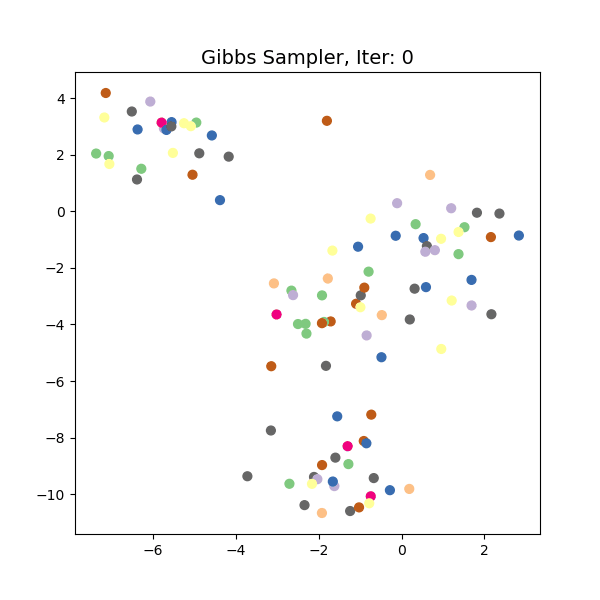
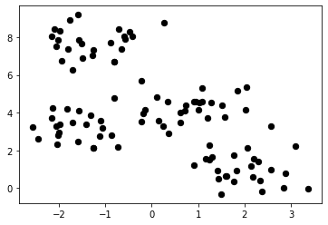
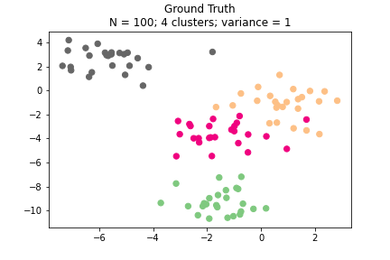
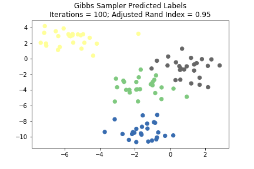

# Nonparametric Bayesian Gibbs sampler for clustering multivariate Gaussian data

This repository includes my implementation of a Gibbs sampler for clustering multivariate Gaussian data with nonparametric Bayesian methods. It includes:

* `gibbs_sampler.py` An implementation of a Gibbs sampler for multivariate Gaussian data based on Algorithm 2 from [Neal (2000)](http://www.stat.columbia.edu/npbayes/papers/neal_sampling.pdf).
* `helper_functions.py` A script for generating a GIF of the Gibbs sampler iterations.
* `test_gibbs.py` A script for testing the Gibbs sampler on randomly generated Gaussian data and generating figures.

## Background

Modeling observed data as a mixture of latent classes with their own distributions is a common framework with applications in many fields. However, the most common types of mixture models assume that the number of classes is known. For unsupervised problems or problems where the "true" number of clusters is unknown, it is difficult to interpret the result of such algorithms. We would like to cluster data without deciding the number of latent classes ahead of time.

One approach to tackling this issue is to use nonparametric Bayesian methods, where the number of classes and associated mixing proportions are assumed to be countably infinite and generated by a Dirichlet process. For a detailed introduction to nonparametric Bayesian methods and Dirichlet processes, please see Tamara Broderick's [Nonparametric Bayes Tutorial](https://tamarabroderick.com/tutorial_2016_mlss_cadiz.html).

## Gibbs sampler

In this project, I adapt the Gibbs sampler from Algorithm 2 in Neal (2000). This algorithm assumes that the data is generated from a Dirichlet process where each data point is drawn from a multivariate Gaussian with parameters according to cluster assignment. Each cluster has a mean drawn from a prior multivariate Gaussian distribution, and the covariance matrix of all clusters is the same. The figure below shows the ground truth labels for data generated in this manner.

The Gibbs sampler learns the most likely partition of clusters by first randomly assigning cluster membership to all datapoints (I choose 10 clusters by default), and then iteratively updating the cluster of each datapoint by drawing from the posterior distribution of its cluster membership conditional on the sampler state. After a specified number of iterations, the predicted cluster membership is simply the mode of all states traversed by the sampler. Below is the result of running the Gibbs sampler for 100 iterations on the the dataset shown above. The Adjusted Rand Index of the labeling is 0.95, meaning that the prediction is almost identical to the ground truth labels.

This toy example can be extended in many ways by relaxing the assumption of constant variance, testing on data with a large class imbalance, and experimenting on high-dimensional data. With more time, I would like to test the algorithm on these more difficult problems.

